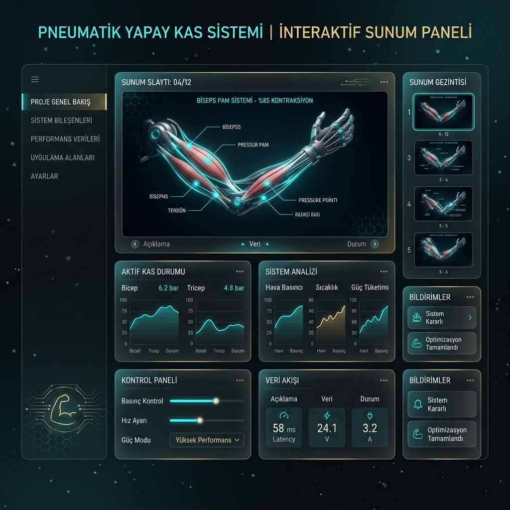
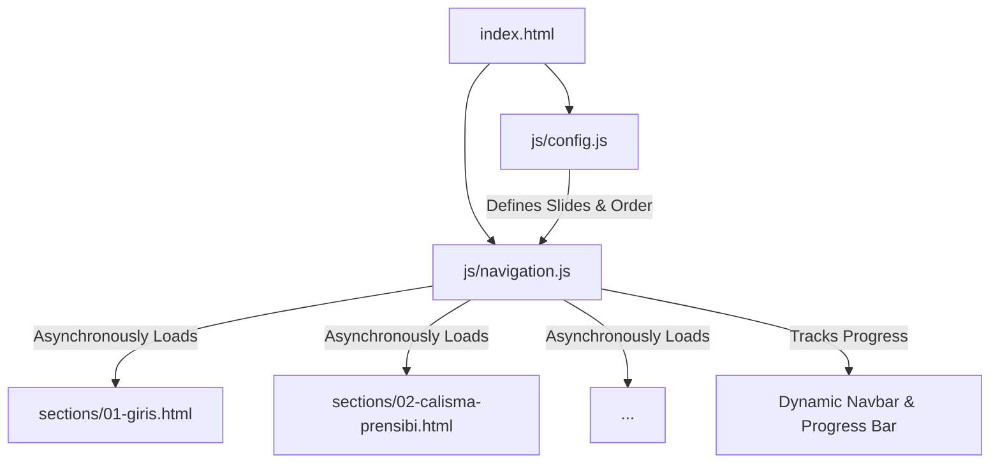

# ✦ Interactive Presentation Engine

> A premium, modular, and cinematic presentation deck and engine built entirely with raw HTML5, Vanilla CSS3, and modern JavaScript. Designed to deliver visually striking, glassmorphic, and high-performance presentations directly in the browser.

[](https://abdulhamidbatayhi123.github.io/pnomatik-yapay-kaslar/)
[](css/styles.css)
[](js/navigation.js)
[](sections/01-giris.html)

<p align="center">
  
</p>

---

## 🌟 Visual Showcase & UX Highlights

This engine is designed to break away from traditional, static PowerPoint-style presentations. It introduces fluid mechanics, organic animations, and cinematic transitions to engage audiences:

*   **Cinematic Preloader:** A pre-rendering sequence that displays institutional branding (e.g., Yıldız Technical University) and presentation titles with smooth bar loading transitions.
*   **Dynamic Mesh Gradients:** Moving, fluid CSS background orbs that float and morph slowly across the screen (`@keyframes orbFloat` and HSL radial gradients).
*   **Canvas Particle Background:** A high-performance canvas particle emitter that overlays interactive floating dust particles on top of the slide panels.
*   **Cursor Spotlight Effect:** A mouse-tracking spotlight gradient that follows the presenter's cursor, casting a subtle, elegant drop-shadow glow onto glassmorphic cards.
*   **Apple-style Glassmorphism:** High-end glassmorphic slide containers featuring backdrop filters (`blur(20px)`), translucent borders, responsive layouts, and soft nested drop shadows.

---

## 🛠️ Engine Architecture

Under the hood, the engine relies on a clean, scalable, modular structure:



### Key Architectural Pillars:
1.  **JSON-Driven Router (`js/config.js`):** Easily define, reorder, and structure slide decks using simple JavaScript arrays of sections. Slides are treated as unique routes.
2.  **Asynchronous Modular Loading:** Slides are kept in separate HTML fragments (`sections/*.html`). The engine loads, parses, and injects slides on-demand using standard asynchronous fetch mechanics, keeping the memory footprint exceptionally low.
3.  **Advanced Navigation Controls:**
    *   **Keyboard Binding:** ←/→ keys, Spacebar, and Enter for step-through logic.
    *   **Dynamic Section Navbar:** A collapsible, hover-activated navigation sidebar that maps out the entire slide config, allowing instant jumping between chapters.
    *   **Precision Progress Indicators:** A slim, high-visibility progress bar at the top of the viewport dynamically scales based on index progress.
4.  **Hardware-Accelerated Transitions:** Transitions utilize modern `transform: scale()` and `filter: blur()` properties with cubic-bezier easing to prevent layout recalculation stutter.

---

## 🦾 Live Demo Showcase: Pneumatic Artificial Muscles (PAM)

As a live showcase of the engine's capability, this repository hosts an advanced presentation deck titled **"Pnömatik Yapay Kas Sistemleri (PAM)"** (Yıldız Technical University). 

This demo covers:
*   **Introduction to PAM:** Background, history, and bionic mimicking principles.
*   **Operational Physics:** Work cycles, gas contraction mechanics, and force/displacement formulas.
*   **System Infrastructure:** Air compressors, proportional valves, pressure regulators, and electronic interfaces.
*   **Comparative Analysis:** Pros and cons compared to electric and hydraulic actuators.
*   **Robotic and Bionic Applications:** Exoskeletons, surgical robotics, and soft-robotics implementations.
*   **Artificial Intelligence Integration:** Neural networks, predictive control loops, and future engineering roadmaps.

---

## 🚀 Quick Start & Deployment

### Run Locally

1.  **Clone the Repository:**
    ```bash
    git clone https://github.com/abdulhamidbatayhi123/pnomatik-yapay-kaslar.git
    cd pnomatik-yapay-kaslar
    ```

2.  **Start a Static Local Server:**
    Since the engine uses standard modular HTML loading (Fetch API), it must be served through a web server (it cannot be run directly via `file://` protocols in some browsers due to CORS security rules).
    
    *Using Node.js:*
    ```bash
    npx http-server -p 8080
    ```
    *Using Python:*
    ```bash
    python -m http.server 8080
    ```

3.  **Open in Browser:**
    Navigate to `http://localhost:8080` to view the running engine.

---

## 🌐 Deploy to GitHub Pages (Presentation Mode)

You can host this deck for free on **GitHub Pages** so it can be presented instantly on any laptop, projector, or mobile device without any terminal commands:

1.  Push this codebase to your GitHub repository.
2.  On GitHub, go to your repository's **Settings** tab.
3.  On the left sidebar, click **Pages** (under the "Code and automation" section).
4.  Under **Build and deployment** -> **Source**, make sure **Deploy from a branch** is selected.
5.  Under **Branch**, select **`main`** and **`/ (root)`**, then click **Save**.
6.  Wait about 1–2 minutes. A green header will appear at the top of the Pages section showing your live URL (e.g., `https://abdulhamidbatayhi123.github.io/pnomatik-yapay-kaslar/`).

Now, you can simply open this link on your professor's laptop or any classroom computer to present live with 100% interactive animations!

---

## 🎨 Theme Customization & Slides

Adding a new section is simple:
1.  Create your slide file in the `sections/` directory (e.g., `sections/10-my-new-slide.html`).
2.  Open `js/config.js` and add your section to the `sections` array:
    ```javascript
    {
        id: "my-new-slide",
        file: "sections/10-my-new-slide.html",
        navLabel: "My New Slide",
        startSlide: 0
    }
    ```
3.  The engine will automatically load, render, configure navigation, and update the slide counts!
